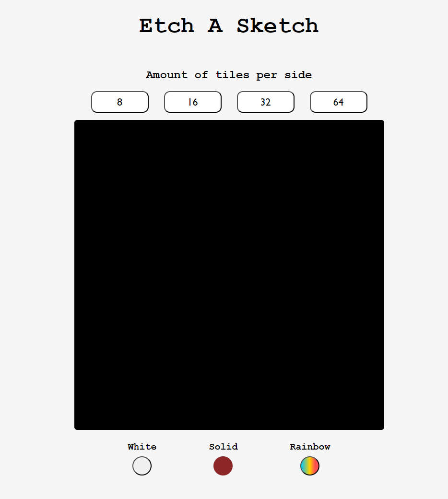

# etch-a-sketch
This project from The Odin Project revolved around making a simplified sketchboard where one can change the pixel density of the board aswell as the color of the brush. Here is a screenshot of my attempt:
